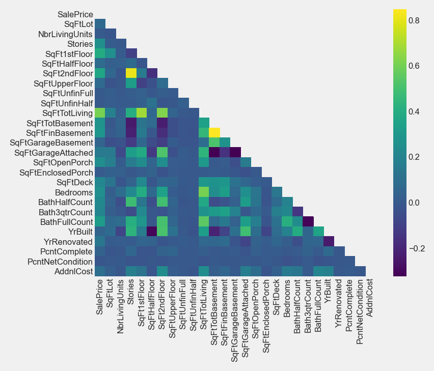
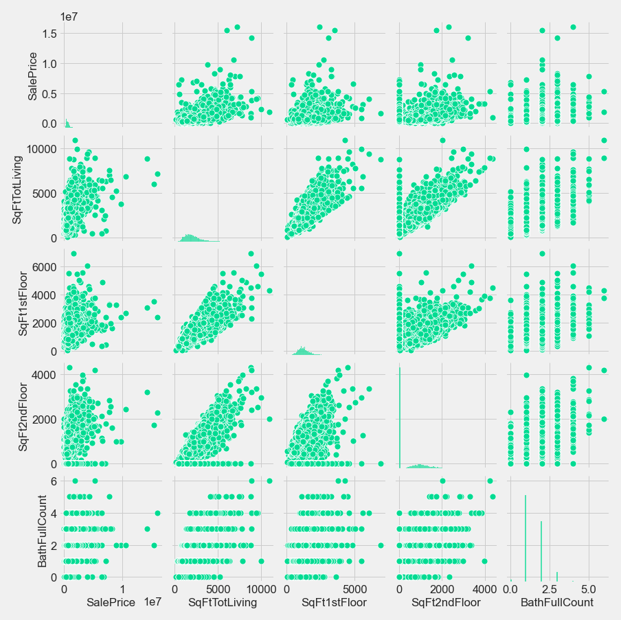
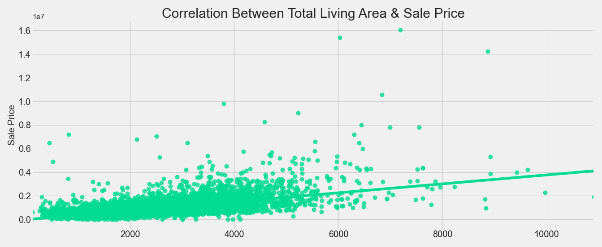
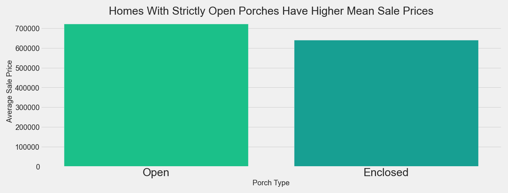
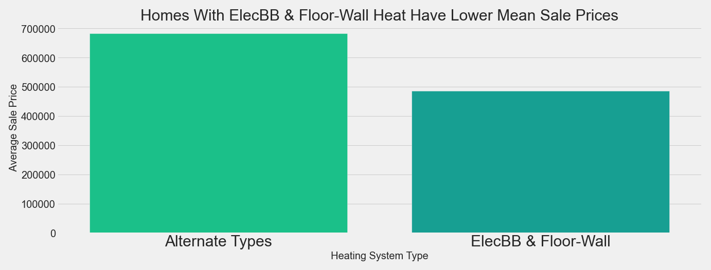
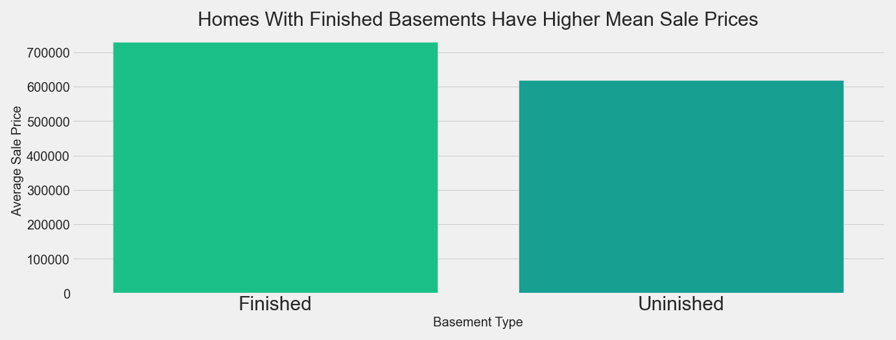
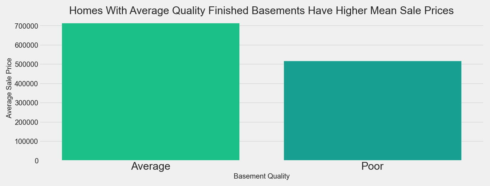

# King County Home Price Analysis

This repository offers an analysis of factors that influence housing prices in King County, WA

## This Repository

### Repository Directory

```
├── README.md        
│                        
│
├── data             
│   ├── processed    
│   └── raw          
│
├── notebooks        
│   ├── exploratory  
│   └── report       
│
├── references       
│
└── reports          
    └── figures      
```

### Quick Links

1. [Final Analysis Notebook](notebooks/exploratory/final_notebook.ipynb)
2. [Presentation Slides](reports/presentation.pdf)

### Setup Instructions

To setup the project environment, `cd` into the project folder and run `conda env create --file king_co.yml` in your terminal. Next, run `conda activate king_co`.


## Business Understanding

A client in King County, WA wants to advise homeowners on home improvement projects that will add to the sale value of their homes, based on data from the most recent full calendar year, 2019.

## Data Understanding

Analysis was based on the King County House Sales dataset from the King County Department of Assessments. The data was presented as three raw csv files of property data and a fourth with information about the various administrative codes used in the other three. The property data was joined into a data frame, and an initial modeling data set was formed that contained 16,323 rows.

The continuous features were grouped together and a correlation matrix and heatmap plot were generated to find the features most correlated to the `SalePrice` target.



From the heatmap above we can see that `SqFtTotLiving`, `SqFt1stFloor`, `SqFt2ndFloor`, and `BathFullCount` are most correlated with `SalePrice`.

After the four most correlated features were identified, a pairplot was generated to further investigate their correlation with the target and each other.



From the pairplot we can see the the four predictors are highly correlated with each other, and this was a concern taken into consideration during the design of the model.



Lastly, a plot was generated of `SalePrice` vs `SqFtTotLiving`, which was the most highly correlated of the continuous features (.61 correlation coefficient). We can see that it is indeed a strong linear relationship.

## Data Preparation
#### Outliers:

After running a simple linear regression baseline model with `SalePrice` as the target and `SqFtTotLiving` as the predictor, a closer look was taken at the data in an attempt to improve performance. Outliers were found (mainly extremely high priced homes) in the `SalePrice` target and removed using the IQR fences method. This refinement helped  to move the model more in line the assumptions of linear regression.

As the modeling process progressed, a price-per-square-foot feature was created and employed to find another set of ouliers (mainly homes with very high price-per-square-foot values) in the data. These were also removed using the IQR fences method. This step resulted in an increase in the coefficient of determination. 

Lastly, a closer look was taken at the residuals by adding `y_hat` (predicted price) and `residual` (actual price - predicted price) features to the data frame and filtering the data by residuals. A subset of outliers (a group that had a mean sale price almost \$470,000 higher than the the dataset as a whole) that had large under-predictions was identified and removed, which again incresed the coefficient of determination and helped bring the residuals of the model more in line with the assumptions of linear regression. Further analysis is needed to fully understand the characteristics of the homes in this subgroup and how they affect the model.

#### Transformations
Log-transforming the target and various predictors was attempted to varying degrees of success; However, better results were found by square-root scaling `SqFtTotLiving` predictor and leaving the other data un-scaled. 

#### Features
Features that could be the subjects of home improvement projects were the focus during the modeling process with an eye toward developing actionable recommendations.

## Modeling

A baseline model was established using simple linear regression with `SalePrice` as the target and `SqFtTotLiving` predictor. The model went through multiple iterations of different predictors and revisions to the data. The final model was implemented using a forward selection method and was run on a data set of 12,980 rows.

The final model is based on the following predictors:
#### Continuous Area Features:
SqFtTotLiving_sqrt, SqFtDeck, SqFtEnclosedPorch, SqFtOpenPorch

#### Categorical Heating System Features:
Radiant, Hot Water, Gravity, Heat Pump, Floor Wall.

The Electric Baseboard heat system feature was dropped during the encoding process and incoporated into the intercept term of the model.

## Evaluation

The coefficient of determination increased slightly from .371 in the baseline model to .375 in the final model. All p-values and confidence intervals for the intercept and coefficients were valid except for the `Floor-Wall` and `SqFtEnclosedPorch` categories. The Jarque_Bera p-value was small and indicated that heteroscadasticity was present in the residuals, but the residuals looked much better in the final model than in the baseline model. While the condition number was large, the Variance Inflation Factor values for the features show no multicollinearity. The final model was an improvement over the baseline model.

The modeling process uncovered a few overall trends in the data that were used as a basis for testing various client recommendations. All of the models have shown a positive correlation between the `SalePrice` target and `SqFtTotalLiving` predictor. The models have also shown that all other heating types have improved the `SalePrice` target relative to ElecBB heat. Lastly, the models have also shown that the `SqFtOpenPorch`, `SqFtEnclosedPorch`, and `SqFtFinBasement` features are all positively correlated with the target. Focusing on the heating system, porches, and basements makes sense for the project, because these are all features that can be changed or upgraded to increase the sale price of homes.

## Conclusion

# Recommendations for Home Improvements

Given the information gleaned from the modeling process, in conjunction with statistical testing methods, the following three home improvement projects were found to correlate to higher home prices:
* Convert enclosed porches to open porches.
* Upgrade Electric Baseboard & Floor-Wall heating systems to alternate heating types.
* Upgrade basements up to a finished quality level of at least average.










## Next Steps

#### Recommendations
* Look into the small set of mixed porches homes to see they can be incorporated into the recommendations.
* More exploration into the alternate heating systems to analyze the upgrade cost vs effect on sale price of homes between the different types of alternate heating systems.
* Quanitify the characteristics that demarcate the various quality levels for finished basements.

#### Modeling 
* More work on the filtered cluster of homes. Hopefully, some clarity can be gain on how they effect the model and steps can be taken to include them in the model, or quantify the effect of leaving them out. 
* The final model is missing the `Forced Air` heating type. Moving forward, a next step in the process is to find a way to add it back in to the model without breaking the independence assuption of linear regression.
* Adding more features to the model to help improve the coefficient determination.